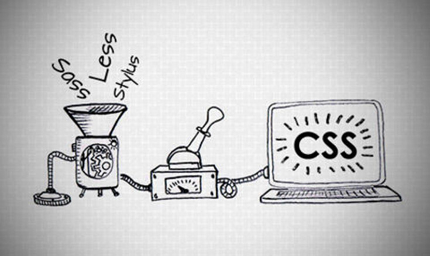

# Препроцессоры

Во время работы над HTML и CSS приходится выполнять множество мелких и однотипных задач: закрытие тегов, написание фигурных скобок, конвертирование цветов из одних значений в другие. Такие задачи повторяются периодически и требуют внимания пользователя, отвлекая его от работы, снижая производительность.

**Препроцессоры** – это программы, которые позволяют автоматизировать часть рутинных операций.

Препроцессор это программа, которая использует свой синтаксис \(метаязык\), а затем преобразовывает его в HTML код \(если это препроцессор HTML\) или в CSS код \(CSS препроцессор\). 

Использование препроцессоров дает ряд преимуществ написанного кода в сравнении с чистым CSS:

* читабельность для человека
* структурированность;
* производительность
* логичность


## HTML-препроцессоры

Наиболее популярными препроцессорами для HTML являются `Pug(Jade)` и `HAML`,

### Pug

**Pug** — это шаблонизатор Html, написанный на языке JavaScript для Node.js. После интерпретации сервером синтаксис Pug превращается в Нtml код. Старое название Pug — Jade. 

Код Pug достаточно прост. Он не имеет угловых скобок и закрывающих тегов. Вложенность элементов определяется отступом — Tab или пробел.

синтаксис Pug чем-то напоминает синтаксис Sass:

* Вложенность определяется отступом \(Tab или пробел\)
* Классы задаются через точку \(.\)
* Id задаются через решетку \(\#\)
* Однострочные комментарии задаются через //

_**Циклы или итерации**_ в Pug позволяют выполнять какие-то множественные операции, написав всего лишь несколько строк кода. 

Большим достоинством Pug является возможность подключения отдельных _**модулей**_ ****кода. То есть можно выносить в отдельные фрагменты кода целые области сайта. Например, можно вынести отдельно header, sidebar, content, footer и все это собрать в одном индексном файле. Такой подход сделает наш код удобочитаемым и в случае правок достаточно изменить в одном месте.

_**Миксины**_ позволяют создавать многократно повторяемые блоки кода. Это практически тоже самое, что и функция в языке программирования.

Pug работает на основе JavaScript поэтому есть возможность использовать _**условия**_ при написании кода, как и в любом другом языке программирования.

Вот пример кода с использованием pag:

```text
//- index.pug
doctype html
html(lang="ru")
    //- Include head
    include ./components/head.pug  
    body
        //- Include header
        include ./components/header.pug
        h1 Заголовок страницы
        p Абзац, небольшое описание
    
    //- Include footer
    include ./components/footer.pug
```

```text
//- Head.pug
head
    meta(charset='UTF-8')
    title Заголовок страницы
    script(src="/js/jquery.js")
    script(src="/js/scripts.js")
```

```text
//- Header.pug
header.header
    .logo Логотип сайта
```

```text
//- Footer.pug
footer.footer
    p Copyright текст
```

В итоге получим в index.html

```text
<!DOCTYPE html>
<html lang="ru">
<head>
    <meta charset="UTF-8">
    <title>Заголовок страницы</title>
    <script src="/js/jquery.js"></script>
    <script src="/js/scripts.js"></script>
</head>
<body>
    <header class="header">
        <div class="logo">Логотип сайта</div>
    </header>	
    
    <h1>Заголовок страницы</h1>
    <p>Абзац, небольшое описание</p>

    <footer class="footer">
        <p>Copyright текст</p>
    </footer>
</body>
</html>
```


### Haml

Haml \([HTML abstraction markup language](http://haml.info/docs/yardoc/file.REFERENCE.html), абстрактный язык разметки HTML\) — это язык разметки с единственной целью — предоставить возможность писать красивую разметку. Являясь собственным языком разметки, код, написанный на Haml, позже преобразуется в HTML. Haml продвигает принцип «не повторяйся» и способствует хорошо структурированной разметке, создавая приятный опыт для тех, кто умеет её писать и читать.


Особенности работы с html-препроцессорами   при желании легко найдете в интернете. Для базовых знаний достаточно знаний о их существовании \)\)


## CSS-препроцессоры

**CSS-препроцессорами** называются надстройки над CSS. 

Если Вы решили делать крупный, серьезный и оптимизированный проект, то лучше использовать какую-либо систему CSS-препроцессоров, потому что без нее можно утонуть в обилии стилей и рано или поздно CSS-код все-таки выйдет из под контроля. Препроцессоры делают CSS на сайте более чистым, лаконичным. 




Пытаясь разобраться в теме, давайте сравним между собой 3 самых популярных на данный момент css-препроцессора: **LESS, SASS, Stylus**. 

### LESS

LESS написан на JavaScript, он дополняет обычный CSS динамическим функциями: переменными, примешиваниями \(Mixins\), операциями и функциями. Из всех приведенных здесь CSS-препроцессоров, LESS обладает наиболее полной и удобной документацией для разработчиков. Он является наиболее легким для осваивания, его синтаксис похож на чистый CSS, позволяет повторно использовать классы в качестве примешиваний в любом месте файла .css.

Бонусом к тому, чтобы использовать LESS можно сказать то, что Twitter Bootstrap активно используют динамические возможности LESS.  
Например, класс

```text
.list-reset {
  margin: 0;
  padding: 0;
  list-style: none;
}
```

может быть использован в любом другом месте:

```text
.menu {
  .list-reset;
  color: green;
}
```

### Stylus

Написан на JavaScript \(node.js\), он объединяет в себе возможности, предоставляемые Sass и LESS. Поддерживает синтаксис как обоих этих систем, так и обычный CSS. Stylus можно использовать вместе с Nib — библиотекой расширений похожей на Compass, что позволяет делать кроссбраузерные CSS примешивания \(Mixins\). Синтаксис очень минималистичный и гибкий, например:

```text
h1
font 2em Helvetica, Arial, sans-serif
```

### SASS\(SCSS\)

Один из самых популярных препроцессоров сегодня - **SASS**.

**Sass \(SCSS\)** - самый мощный из CSS-препроцессоров. Имеет довольно большое сообщество разработчиков. 

Основан в 2007 году как модуль для HAML и написан на Ruby \(есть порт на C++\). Имеет куда больший ассортимент возможностей в сравнении с Less. Возможности самого препроцессора расширяются за счёт многофункциональной библиотеки Compass, которая позволяет выйти за рамки CSS и работать, например, со спрайтами в автоматическом режиме.

 _**Имеет два синтаксиса:**_ 

👉 _****_**Sass \(Syntactically Awesome Style Sheets\)** — упрощённый синтаксис CSS, который основан на идентации. Считается устаревшим. 

👉 _****_**SCSS \(Sassy CSS\)** — основан на стандартном для CSS синтаксисе.

Главное отличие SASS синтаксиса от SCSS синтаксиса - _SCSS синтаксис имеет обратную совместимость с CSS_. Это значит что мы можем вставить сниппет CSS кода в SCSS файл и он будет валиден.

 В случае с SASS - необходимо будет немного изменить синтаксис. 

Определение областей видимости внутри SASS файла определяется количеством отступов слева, в SCSS - также как в CSS - фигурными скобками `{}`.

Приведенные ниже примеры абсолютно идентичны по функционалу \(первый написан на SCSS, второй на SASS\).

```text
nav {
  ul {
    margin: 0;
    padding: 0;
    list-style: none;
  }

  li { display: inline-block; }
}
```

```text
nav
  ul
    margin: 0
    padding: 0
    list-style: none

  li
    display: inline-block
```

 Именно SCSS мы и будем использовать далее.


## SCSS

Для использования препроцессоров необходимо установить программу, которая будет отслеживать изменения в файлах, предназначенных для препроцессора, и при выявленных изменениях компилировать содержимое этих файлов в чистый CSS-код.

### Компиляция\(преобразование\) с SCSS в CSS

Для того, чтобы скомпилировать SASS/SCSS в результирующий CSS нам необходимо установить соответствующий `npm пакет`, написать стили в SASS/SCSS синтаксисе и скомпилировать CSS при помощи установленного пакета

`npm install -g sass`

`touch style.scss`

```text
.parent {
    color: green;
    
    .child {
        color: red;
    }
}
```

`sass style.scss style.css`

Если вы все сделали правильно - то рядом у вас должен появиться вот такой CSS файл:

```text
.qwe {
  color: green;
}
.qwe .rty {
  color: red;
}

/*# sourceMappingURL=style.css.map */
```

### 

### Переменные

 Это удобно!

Переменные в SСSS записываются с помощью символа **`$`** и позволяют хранить строки, цвета, булевы значения и даже целые списки свойств.  

\*\*\*\*❗ **Важно:** переменные не будут доступны, если использовать их перед объявлением. Сначала объявляем, затем используем!

Записываем в переменную с именем `theme-color` цвет нашей темы/сайта:

```text
//в файле _variables.css 

$theme-color: #010703;
$theme-bg: #333;


// в файле стилей
h1 {
  color: $theme-color;
}  
button {
  color: $theme-color;
  backgroung: $theme-bg;
}
```

 Сменим значение переменной — получим изменения везде, где она применялась. Хорошей практикой является создание отдельного файла для переменных \(например `_variables.scss`\).  

Переменные вам пригодятся во избежание дублирования кода \(вам не нужно запоминать и затем искать по коду цвет текста или, например, размер шрифта, если вы определите его в переменную и затем будете использовать эту переменную\). 

Также это поможет при каких либо глобальных изменениях в стилях \(например дизайнер говорит вам "поменяй ка мне оранжевый цвет на зеленый по всему сайту", и, если ранее, вам приходилось искать и изменять все значения цвета по всем подключенным CSS-кам - то теперь достаточно изменить значение этой переменной\). 

Также в SASS есть несколько полезных математических операторов \(+, -, \*, / и %\), которые можно использовать в вычислениях.

```text
$base: 960px;

.left-column {
  width: 200px / $base * 100%;
}
```

### Вложенность

 Если нам необходимо стилизовать совокупность элементов, которые имеют иерархическую структуру \(например `nav.menu>ul>li>a`\) - необходимо писать множество селекторов в таблице стилей:

```text
nav.menu { ... }
nav.menu>ul { ... }
nav.menu>ul>li { ... }
nav.menu>ul>li>a { ... }
```

При помощи SASS/SCSS это станет в разы проще. \*\*Важно: не злоупотребляйте вложенностью. Если вы будете использовать слишком много уровней вложенности - ваш код будет тяжело поддерживать и изменять.

```text
nav {
  &.menu {
    background: #000;
    &>ul {
      list-style: none;
      &>li {
        border: 1px solid red;
        a {
          text-decoration: none;
        }
      }
    }
  }
}
```

###  Примеси \(@mixin\), экстенды \(@extend\)

Самый главный плюс препроцессоров — это в миксинах, экстендах и т.п. Это как функции в нормальном языке — можно использовать бесконечное количество раз, подключая когда необходимо. 

```text
// Создание примеси
@mixin clearfix {

  &:after {
    content: "";
    display: table;
    clear: both;
  }
}

// Применение примеси
.promo__wrapper {
  @include clearfix;
  padding: 1em;
}
```

Еще одним, более масштабным инструментом, который помогает нам избежать дублирования кода является `@extend`. 

```text
%rounded-button {
  border: 1px solid #ccc;
  padding: 10px;
  border-radius: 4px;
  color: #333;
}

button {
  @extend %rounded-button;
}
a[href] {
  @extend %rounded-button;
  text-decoration: underline;
}
```

### Фрагментирование

 Вы можете создавать фрагменты Sass-файла, которые будут содержать в себе небольшие отрывки CSS, которые можно будет использовать в других Sass-файлах. Это отличный способ сделать ваш CSS модульным, а также облегчить его обслуживание. 

Фрагмент — это простой Sass-файл, имя которого начинается с нижнего подчеркивания, например, `_partial.scss`. Нижнее подчеркивание в имени Sass-файла говорит компилятору о том, что это только фрагмент и он не должен компилироваться в CSS. Фрагменты Sass подключаются при помощи директивы `@import`.

### Математические операторы

 Использовать математику в CSS очень полезно. Sass имеет несколько стандартных математических операторов, таких как `+`, `-`, `*`, `/` и `%`. В нашем примере мы совершаем простые математические вычисления для расчета ширины `aside` и `article`.

```text
//Код SCSS

.container {
  width: 100%;
}

article[role="main"] {
  float: left;
  width: 600px / 960px * 100%;
}

aside[role="complementary"] {
  float: right;
  width: 300px / 960px * 100%;
}
```

```text
//Код CSS

.container {
  width: 100%;
}

article[role="main"] {
  float: left;
  width: 62.5%;
}

aside[role="complementary"] {
  float: right;
  width: 31.25%;
}
```

### Компиляция препроцессорного кода в CSS, минимизация, карта стиля

Как вы могли заметить - по умолчанию в сгенерированном css файле содержится комментарий `/*# sourceMappingURL=style.css.map */`, и кроме css файла рядом генерируется еще один файл с суффиксом `.css.map`. Это карта стиля.

Карта стиля необходима для упрощения процесса отладки css кода. Т.к. браузер читает и понимает только результирующий CSS код - то соответственно в отладчике ссылку на стиль он указывает в CSS файле \(где он этот стиль и подчерпнул\).

 Source map - это инструкция браузеру, каким образом связать наши исходные файлы \(SASS/SCSS\) с результирующей CSS таблицей. **Благодаря source maps - в отладчике браузера мы видим отсылки с строкам SASS а не CSS**, что позволяет нам быстрее и проще дебажить наш код.  


